# مدیریت ریسک در پروژه‌ها - نسخه 2.0

> **نسخه:** 2.0 | **تاریخ انتشار:** آبان ۱۴۰۴

!!! success "نسخه جاری"
    شما در حال مشاهده **نسخه 2.0 (آخرین نسخه)** هستید. [📗 مشاهده نسخه 1.0](../v1.0/overview.md)

این سند به بررسی جامع مدیریت ریسک در پروژه‌های PMO می‌پردازد.

## تعریف ریسک

ریسک یک رویداد یا شرایط نامطمئن است که در صورت وقوع، تأثیر مثبت یا منفی بر اهداف پروژه دارد.

## انواع ریسک

### 1. ریسک‌های فنی

- مشکلات تکنولوژی
- عدم کارایی سیستم‌ها
- نقص‌های طراحی

### 2. ریسک‌های مدیریتی

- ضعف در مدیریت پروژه
- تعارض در تیم
- ارتباطات ناکافی

### 3. ریسک‌های مالی

- افزایش هزینه‌ها
- کاهش بودجه
- نوسانات ارزی

### 4. ریسک‌های خارجی

- تغییرات قانونی
- شرایط بازار
- عوامل محیطی

## فرآیند مدیریت ریسک

```mermaid
graph TD
    A[شناسایی ریسک] --> B[تحلیل کیفی]
    B --> C[تحلیل کمی]
    C --> D[برنامه‌ریزی پاسخ]
    D --> E[پایش و کنترل]
    E --> A
```



## شناسایی ریسک

روش‌های شناسایی:

1. **طوفان فکری (Brainstorming)**
   - جلسات تیمی
   - مشارکت ذینفعان
   - استفاده از تجربیات گذشته

2. **تحلیل SWOT**
   - قوت‌ها (Strengths)
   - ضعف‌ها (Weaknesses)
   - فرصت‌ها (Opportunities)
   - تهدیدها (Threats)

3. **بررسی اسناد**
   - پروژه‌های مشابه
   - دروس آموخته
   - استانداردها

## ارزیابی ریسک

### ماتریس احتمال-تأثیر

| احتمال \ تأثیر | خیلی کم | کم | متوسط | زیاد | خیلی زیاد |
|---------------|---------|-----|-------|------|-----------|
| **خیلی زیاد** | 🟡 | 🟠 | 🟠 | 🔴 | 🔴 |
| **زیاد** | 🟡 | 🟡 | 🟠 | 🟠 | 🔴 |
| **متوسط** | 🟢 | 🟡 | 🟡 | 🟠 | 🟠 |
| **کم** | 🟢 | 🟢 | 🟡 | 🟡 | 🟠 |
| **خیلی کم** | 🟢 | 🟢 | 🟢 | 🟡 | 🟡 |

### محاسبه نمره ریسک

$$
\text{Risk Score} = \text{Probability} \times \text{Impact}
$$

مثال:

$$
\text{RS} = 0.7 \times 0.8 = 0.56
$$

## استراتژی‌های پاسخ به ریسک

### ریسک‌های منفی (تهدیدها)

1. **اجتناب (Avoid)**
   - تغییر برنامه پروژه
   - حذف فعالیت پرریسک

2. **انتقال (Transfer)**
   - بیمه
   - قرارداد پیمانکاری
   - استفاده از تأمین‌کنندگان خارجی

3. **کاهش (Mitigate)**
   - اقدامات پیشگیرانه
   - برنامه‌های آموزشی
   - تست‌های بیشتر

4. **پذیرش (Accept)**
   - ذخیره احتیاطی
   - برنامه اضطراری

### ریسک‌های مثبت (فرصت‌ها)

1. **بهره‌برداری (Exploit)**
2. **به اشتراک‌گذاری (Share)**
3. **تقویت (Enhance)**
4. **پذیرش (Accept)**

## ثبت ریسک

نمونه فرم ثبت ریسک:

| شناسه | شرح ریسک | احتمال | تأثیر | نمره | استراتژی | مسئول | وضعیت |
|------|----------|--------|-------|------|----------|-------|-------|
| R001 | تأخیر در تأمین تجهیزات | ۰.۷ | ۰.۸ | ۰.۵۶ | کاهش | مدیر تدارکات | فعال |
| R002 | کمبود نیروی متخصص | ۰.۵ | ۰.۹ | ۰.۴۵ | انتقال | مدیر منابع انسانی | فعال |

## نظارت و کنترل ریسک

!!! note "یادآوری"
    ریسک‌ها باید به‌طور مداوم بازبینی شوند.

### شاخص‌های کنترل

```python
class RiskMonitor:
    def __init__(self, risks):
        self.risks = risks
    
    def calculate_exposure(self):
        """محاسبه میزان قرار گرفتن در معرض ریسک"""
        total_exposure = sum(
            risk.probability * risk.impact * risk.cost
            for risk in self.risks
        )
        return total_exposure
    
    def get_top_risks(self, n=5):
        """دریافت n ریسک برتر"""
        sorted_risks = sorted(
            self.risks,
            key=lambda r: r.probability * r.impact,
            reverse=True
        )
        return sorted_risks[:n]
```

## مطالعه موردی

### پروژه: پیاده‌سازی سیستم ERP

**ریسک شناسایی شده:** مقاومت کارکنان در برابر تغییر

- **احتمال:** ۰.۸ (زیاد)
- **تأثیر:** ۰.۷ (زیاد)
- **نمره ریسک:** ۰.۵۶

**استراتژی پاسخ:** کاهش

**اقدامات:**

1. برگزاری جلسات توجیهی
2. آموزش کاربران
3. مشارکت دادن کارکنان در فرآیند
4. پشتیبانی مستمر

**نتیجه:** ریسک با موفقیت مدیریت شد و نرخ پذیرش سیستم به ۹۰٪ رسید.

## منابع و ابزارها

### ابزارهای نرم‌افزاری

- Microsoft Project
- RiskyProject
- @RISK
- Monte Carlo Simulation Tools

### چک‌لیست مدیریت ریسک

- [ ] شناسایی ریسک‌ها
- [ ] تحلیل کیفی
- [ ] تحلیل کمی (در صورت نیاز)
- [ ] تهیه برنامه پاسخ
- [ ] تخصیص مسئولیت
- [ ] ثبت در رجیستر ریسک
- [ ] بازبینی منظم
- [ ] به‌روزرسانی برنامه‌ها

## جمع‌بندی

!!! success "نکات کلیدی"
    - مدیریت ریسک یک فرآیند مستمر است
    - همه ذینفعان باید در شناسایی ریسک مشارکت داشته باشند
    - برنامه‌های پاسخ باید واقع‌بینانه و قابل اجرا باشند
    - نظارت مداوم ضروری است

---

[🏠 بازگشت به انتخاب نسخه](../../index.md) | [📗 مشاهده نسخه 1.0](../v1.0/overview.md)
