# مدیریت ریسک در پروژه‌ها - نسخه 3.0

> **نسخه:** 3.0 | **تاریخ انتشار:** آبان ۱۴۰۴ (به‌روزرسانی جدید)

!!! success "نسخه جاری"
    شما در حال مشاهده **نسخه 3.0 (آخرین نسخه)** هستید. 
    
    **نسخه‌های دیگر:** [📗 نسخه 1.0](../v1.0/overview.md) | [📘 نسخه 2.0](../v2.0/overview.md)

این سند به بررسی پیشرفته مدیریت ریسک در پروژه‌های PMO می‌پردازد.

## 🆕 تغییرات نسخه 3.0

- ✨ اضافه شدن بخش تحلیل کمی ریسک
- ✨ اضافه شدن شبیه‌سازی Monte Carlo
- ✨ داشبورد مدیریت ریسک
- ✨ یکپارچه‌سازی با ابزارهای هوش مصنوعی
- 🔄 بهبود فرمول‌های محاسباتی

## تعریف ریسک

ریسک یک رویداد یا شرایط نامطمئن است که در صورت وقوع، تأثیر مثبت یا منفی بر اهداف پروژه دارد.

## انواع ریسک

### 1. ریسک‌های فنی

- مشکلات تکنولوژی
- عدم کارایی سیستم‌ها
- نقص‌های طراحی
- 🆕 ریسک‌های امنیت سایبری

### 2. ریسک‌های مدیریتی

- ضعف در مدیریت پروژه
- تعارض در تیم
- ارتباطات ناکافی
- 🆕 عدم چابکی سازمانی

### 3. ریسک‌های مالی

- افزایش هزینه‌ها
- کاهش بودجه
- نوسانات ارزی
- 🆕 ریسک‌های تورمی

### 4. ریسک‌های خارجی

- تغییرات قانونی
- شرایط بازار
- عوامل محیطی
- 🆕 تحریم‌ها و تغییرات ژئوپلیتیک

## فرآیند مدیریت ریسک پیشرفته

```mermaid
graph TD
    A[شناسایی ریسک] --> B[تحلیل کیفی]
    B --> C[تحلیل کمی]
    C --> D[شبیه‌سازی Monte Carlo]
    D --> E[برنامه‌ریزی پاسخ]
    E --> F[پایش با AI]
    F --> A
```



## تحلیل کمی ریسک

### شبیه‌سازی Monte Carlo

```python
import numpy as np
import matplotlib.pyplot as plt

class MonteCarloRiskAnalysis:
    def __init__(self, iterations=10000):
        self.iterations = iterations
        
    def simulate_cost_risk(self, base_cost, risk_factors):
        """شبیه‌سازی ریسک هزینه"""
        results = []
        
        for _ in range(self.iterations):
            total_cost = base_cost
            for risk in risk_factors:
                if np.random.random() < risk['probability']:
                    impact = np.random.uniform(
                        risk['min_impact'], 
                        risk['max_impact']
                    )
                    total_cost += impact
            results.append(total_cost)
        
        return np.array(results)
    
    def calculate_statistics(self, results):
        """محاسبه آمار نتایج"""
        return {
            'mean': np.mean(results),
            'median': np.median(results),
            'std': np.std(results),
            'percentile_90': np.percentile(results, 90),
            'percentile_95': np.percentile(results, 95)
        }

# مثال استفاده
risk_factors = [
    {'probability': 0.7, 'min_impact': 10000, 'max_impact': 50000},
    {'probability': 0.5, 'min_impact': 5000, 'max_impact': 30000},
    {'probability': 0.3, 'min_impact': 20000, 'max_impact': 100000}
]

mc = MonteCarloRiskAnalysis()
results = mc.simulate_cost_risk(base_cost=1000000, risk_factors=risk_factors)
stats = mc.calculate_statistics(results)

print(f"میانگین هزینه: {stats['mean']:,.0f}")
print(f"90% اطمینان: {stats['percentile_90']:,.0f}")
```

## ماتریس احتمال-تأثیر پیشرفته

| احتمال \ تأثیر | خیلی کم | کم | متوسط | زیاد | خیلی زیاد |
|---------------|---------|-----|-------|------|-----------|
| **خیلی زیاد (>80%)** | 🟡 متوسط | 🟠 بالا | 🔴 بحرانی | 🔴 بحرانی | ⚫ فاجعه |
| **زیاد (60-80%)** | 🟢 پایین | 🟡 متوسط | 🟠 بالا | 🔴 بحرانی | 🔴 بحرانی |
| **متوسط (40-60%)** | 🟢 پایین | 🟡 متوسط | 🟡 متوسط | 🟠 بالا | 🔴 بحرانی |
| **کم (20-40%)** | 🟢 پایین | 🟢 پایین | 🟡 متوسط | 🟠 بالا | 🟠 بالا |
| **خیلی کم (<20%)** | 🟢 پایین | 🟢 پایین | 🟢 پایین | 🟡 متوسط | 🟠 بالا |

### فرمول‌های پیشرفته

**محاسبه ارزش مورد انتظار (EMV):**

$$
EMV = \sum_{i=1}^{n} (P_i \times I_i)
$$

**محاسبه ذخیره احتیاطی (Contingency Reserve):**

$$
CR = \sqrt{\sum_{i=1}^{n} (P_i \times I_i^2)}
$$

**شاخص عملکرد ریسک (RPI):**

$$
RPI = \frac{\text{Risks Closed}}{\text{Total Identified Risks}} \times 100
$$

## داشبورد مدیریت ریسک

### شاخص‌های کلیدی (KRI)

| شاخص | مقدار فعلی | آستانه | وضعیت |
|------|-----------|---------|-------|
| تعداد ریسک‌های بحرانی | 3 | ≤ 5 | 🟢 سبز |
| میانگین نمره ریسک | 0.42 | ≤ 0.5 | 🟢 سبز |
| درصد ریسک‌های بسته شده | 65% | ≥ 60% | 🟢 سبز |
| زمان پاسخ به ریسک | 2.5 روز | ≤ 3 روز | 🟢 سبز |

## یکپارچه‌سازی با هوش مصنوعی

```python
class AIRiskPredictor:
    """پیش‌بینی ریسک با یادگیری ماشین"""
    
    def __init__(self, model_type='random_forest'):
        self.model_type = model_type
        self.model = None
        
    def train(self, historical_data):
        """آموزش مدل با داده‌های تاریخی"""
        from sklearn.ensemble import RandomForestClassifier
        
        X = historical_data[['complexity', 'team_size', 'duration', 'budget']]
        y = historical_data['risk_occurred']
        
        self.model = RandomForestClassifier(n_estimators=100)
        self.model.fit(X, y)
        
    def predict_risk(self, project_features):
        """پیش‌بینی احتمال وقوع ریسک"""
        probability = self.model.predict_proba([project_features])[0][1]
        
        return {
            'risk_probability': probability,
            'risk_level': self._classify_risk(probability),
            'recommendation': self._get_recommendation(probability)
        }
    
    def _classify_risk(self, prob):
        if prob > 0.7:
            return 'بالا'
        elif prob > 0.4:
            return 'متوسط'
        return 'پایین'
    
    def _get_recommendation(self, prob):
        if prob > 0.7:
            return 'اقدام فوری و تخصیص منابع اضافی'
        elif prob > 0.4:
            return 'نظارت دقیق و برنامه‌ریزی پاسخ'
        return 'پایش معمول'
```

## مطالعه موردی پیشرفته

### پروژه: تحول دیجیتال سازمان

**ریسک‌های شناسایی شده:**

| ID | ریسک | احتمال | تأثیر | EMV | استراتژی |
|----|------|--------|-------|-----|----------|
| R001 | مقاومت در برابر تغییر | 0.8 | $500K | $400K | کاهش |
| R002 | نقص فنی سیستم | 0.4 | $1M | $400K | انتقال |
| R003 | تأخیر در تحویل | 0.6 | $300K | $180K | کاهش |
| R004 | افزایش هزینه | 0.5 | $600K | $300K | پذیرش |

**ذخیره احتیاطی محاسبه شده:** $687,000

**نتایج شبیه‌سازی Monte Carlo:**
- میانگین هزینه: $8.2M
- 90% اطمینان: $9.5M
- 95% اطمینان: $10.1M

**اقدامات انجام شده با AI:**
- پیش‌بینی خودکار ریسک‌های جدید
- هشدار زودهنگام برای ریسک‌های بحرانی
- بهینه‌سازی تخصیص منابع

## ابزارهای پیشرفته

### نرم‌افزارها

- Microsoft Project + Risk Analysis
- Primavera Risk Analysis
- @RISK Professional
- RiskyProject Pro
- 🆕 IBM Watson Risk Analytics
- 🆕 Oracle Crystal Ball
- 🆕 Python Risk Libraries

### فریم‌ورک‌ها

- ISO 31000:2018
- PMBOK Guide 7th Edition
- PRINCE2 Risk Management
- 🆕 COSO ERM Framework
- 🆕 Basel III (برای ریسک‌های مالی)

## چک‌لیست جامع مدیریت ریسک

### مرحله شناسایی
- [ ] برگزاری جلسات طوفان فکری
- [ ] تحلیل SWOT
- [ ] بررسی دروس آموخته
- [ ] مصاحبه با خبرگان
- [ ] 🆕 تحلیل با هوش مصنوعی

### مرحله تحلیل
- [ ] تحلیل کیفی
- [ ] تحلیل کمی
- [ ] 🆕 شبیه‌سازی Monte Carlo
- [ ] 🆕 تحلیل حساسیت
- [ ] محاسبه EMV

### مرحله پاسخ
- [ ] تعیین استراتژی
- [ ] تخصیص مسئولیت
- [ ] محاسبه ذخیره احتیاطی
- [ ] 🆕 اتوماسیون پاسخ‌ها

### مرحله پایش
- [ ] بروزرسانی رجیستر ریسک
- [ ] بررسی KRI ها
- [ ] 🆕 داشبورد real-time
- [ ] 🆕 گزارش‌دهی خودکار

## جمع‌بندی و نوآوری‌ها

!!! success "نکات کلیدی نسخه 3.0"
    - استفاده از شبیه‌سازی Monte Carlo برای پیش‌بینی دقیق‌تر
    - یکپارچه‌سازی با هوش مصنوعی برای هشدار زودهنگام
    - داشبورد real-time برای تصمیم‌گیری سریع‌تر
    - فرمول‌های پیشرفته‌تر برای محاسبات مالی
    - اتوماسیون فرآیندهای روتین

---

**نسخه:** 3.0  
**تاریخ آخرین بروزرسانی:** آبان ۱۴۰۴  
**مسئول سند:** دفتر مدیریت پروژه (PMO)

---

[🏠 بازگشت به انتخاب نسخه](../../index.md) | [📗 نسخه 1.0](../v1.0/overview.md) | [📘 نسخه 2.0](../v2.0/overview.md)
